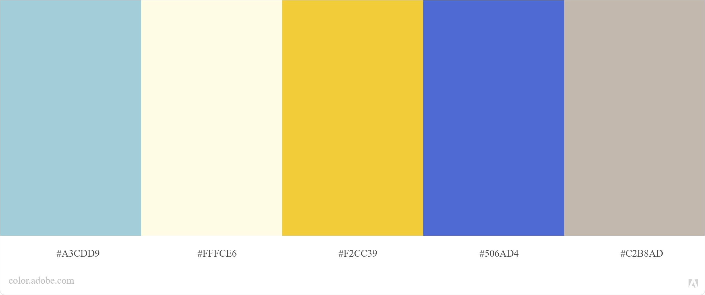

# page web statique

> Bachelor Développeur d'application web
> Évaluation d'entraînement - Créer un site web avec HTML, CSS et le Framework Bootstrap"

### Installation
>git clone https://github.com/bensaadmucret/page-web-statique.git
> 
>cd page-web-statique

>npm install
> 
>npm run build # pour compiler le site


### Tech

- [sass]
- [Twitter Bootstrap]
- [https://getwaves.io/ | créer des vagues en SVG]
- [AOS Animate On Scroll Library]

### Images source 
https://pixabay.com/fr/

### Inspiration

- [ https://workspace.google.com/products/gmail/?utm_source=gmailforwork&utm_medium=et&utm_campaign=global-xsell-website-ft-gmail_for_work_googleworkspacelink&utm_content=forwork#]

### Palette



```xml
<palette>
<color rgb='A3CDD9' r='163' g='205' b='216' />
<color rgb='FFFCE6' r='255' g='251' b='230' />
<color rgb='F2CC39' r='242' g='204' b='56' />
<color rgb='506AD4' r='80' g='105' b='212' />
<color rgb='C2B8AD' r='193' g='184' b='172' />
</palette>
```

## published at https://bensaadmucret.github.io/page-web-statique/
